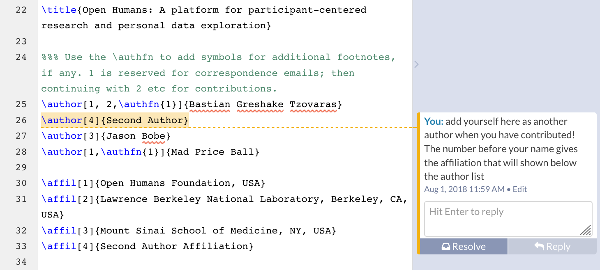

# Writing a collaborative paper about Open Humans

In the community spirit of *Open Humans*, we want to write the paper describing *Open Humans*
together with the community at large. To make the collaborative writing process easy, we
have decided to use the collaborative LaTeX writing environment *Overleaf*.

[Click here to read the current draft](https://v2.overleaf.com/read/kybdrqszgpzs).

To propose changes and help writing the manuscript you need to create an account on Overleaf.
Once you have an account [you can use this link to start proposing changes right away](https://v2.overleaf.com/8738396447qmjjpsytdpgz).

While we are using a *GigaScience* LaTeX template, we are still having an open discussion where we should submit our manuscript!

**To discuss this manuscript you can [join the #oh-manuscript channel on our slack](http://slackin.openhumans.org/)**

Find some guidelines on how Overleaf works below.

## Making changes

When you are logged in into *Overleaf* you should see a site that looks like above. On the left-hand side of the window you can see the raw *LaTeX* text/code for the writing. You can start writing in there right away!
On the right-hand side you see the compiled *LaTeX* document as a preview how the final document would look like.

By default the right-hand side might not update automatically. To change this click on the arrow on the *Recompile* button and enable this feature. Don't worry about making changes to the text of the left, as the changes are easily tracked.

To see the tracked changes you can click on the *Review* button on the top right-bar. Proposed changes can then easily be rejected or accepted by one of the document owners.

## Seeing & Writing comments

In addition to proposed changes to the text, the document is also annotated with comments. These are also visible when the *Review* pane is open. See the screenshot below for an example of a comment.

If you want to write your own comment you can just select some existing text and then press the *add comment* button.

## Adding yourself as an author

After you have contributed to the manuscript you should add yourself to the authorlist! It's up in the first lines of the document. Besides your name you might want to leave an affiliation.

(and if you're [having an ORCID](https://orcid.org/) you might want to leave a comment with it to your name!)

## Citations
Properly citing stuff can be hard, especially if you would want to write your own BibTeX entries. Luckily, there is an easier way. At least if you want to cite an academic paper that comes with a DOI (Digital Object Identifier). DOIs look like this `10.1371/journal.pone.0089204` and are sometimes given as a link like `https://doi.org/10.1371/journal.pone.0089204` or `https://dx.doi.org/10.1371/journal.pone.0089204`.

If you find one of these on the thing you want to cite, making a BibTeX compatible citation is easy, thanks to [doi2bib](https://www.doi2bib.org/). You can just paste the DOI as e.g. `10.1371/journal.pone.0089204` and they will give you the full BibTeX formatted entry to add to the citation list.

To add the citation copy & paste the output of doi2bib and append it to the `paper-refs.bib` in the Overleaf project. (fun fact: bib2tex also works with arxiv & PMID identifiers if you have only those).

Your object doesn't have a DOI or you feel doing BibTeX is too hard? Just leave a comment on the document with a link to the thing you want to cite and we'll enter it for you. 
